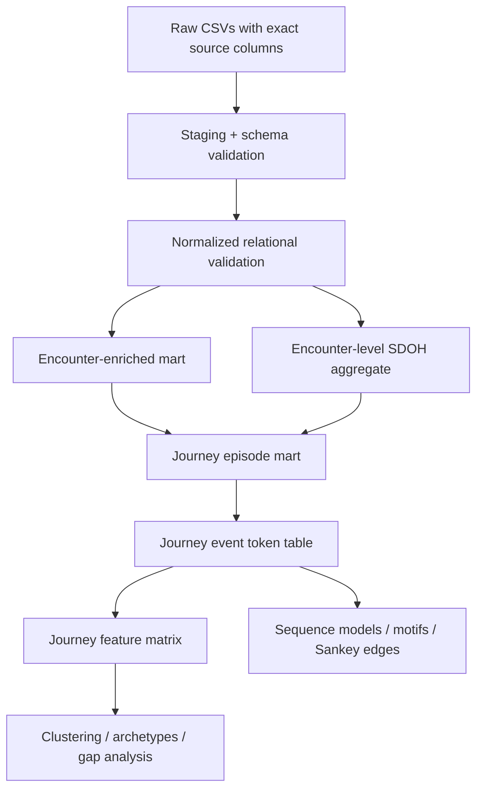

# DataFest 2026 Data Structure Design

Generated: 2026-05-02  
Status: **schema-synced to the explicit column lists supplied by the team**

## Purpose

This file proposes a robust, analysis-ready data structure for modeling patient journeys. It is built around an interpretable pipeline:

```text
raw CSVs → staging/validation layer → enriched encounter layer → SDOH aggregate layer → journey episode layer → sequence/token layer → modeling/story tables
```

The design separates documented source fields from derived modeling choices. Raw/staging tables should preserve exact source column names. Derived marts may use snake_case aliases, but every alias must map back to one exact source column.

## Non-negotiable schema rule

Do not guess or invent source column names. Use only the exact source columns below.

### Exact source columns

| CSV | Exact columns |
|---|---|
| `departments.csv` | `DepartmentKey`, `Address`, `City`, `County`, `DepartmentName`, `DepartmentSpecialty`, `DepartmentType`, `PostalCode`, `CensusTract` |
| `diagnosis.csv` | `DiagnosisKey`, `GroupName`, `GroupCode`, `DiagnosisName`, `DiagnosisValue` |
| `encounters.csv` | `Date`, `AdmissionInstant`, `AdmitYear`, `AdmitMonth`, `AdmitDay`, `AdmitHour`, `AdmitMinute`, `AdmissionSource`, `AdmissionType`, `DischargeInstant`, `DischargeYear`, `DischargeMonth`, `DischargeDay`, `DischargeHour`, `DischargeMinute`, `EncounterKey`, `PatientDurableKey`, `Type`, `VisitType`, `VisitTypeDescription`, `ProviderDurableKey`, `AttendingProviderDurableKey`, `DischargeProviderDurableKey`, `DepartmentKey`, `PrimaryDiagnosisKey`, `IsEdVisit`, `IsHospitalAdmission`, `IsHospitalOutpatientVisit`, `IsInpatientAdmission`, `IsObservation`, `IsOutpatientFaceToFaceVisit` |
| `patients.csv` | `CensusBlockGroupFipsCode`, `DurableKey`, `FirstRace`, `MaritalStatus`, `MyChartStatus`, `OmbEthnicity`, `OmbRace`, `SexAssignedAtBirth`, `SexualOrientation`, `SmokingStatus`, `VitalStatus`, `PatientBirthYearBin` |
| `providers.csv` | `DurableKey`, `ClinicianTitle`, `OfficeAddress`, `OfficeCity`, `OfficePostalCode`, `PrimaryDepartment`, `PrimarySpecialty`, `Type` |
| `social_determinants.csv` | `DisplayName`, `AnswerText`, `EncounterKey`, `PatientDurableKey`, `Domain` |
| `tigercensuscodes.csv` | `GEOID`, `PopulationValue`, `CENTLAT`, `CENTLON` |

## Ground rules

1. Treat `encounters.csv` as the event spine.
2. Treat patient journeys as observed sequences, not necessarily complete real-world journeys.
3. Use `encounters.PrimaryDiagnosisKey` only as a diagnosis join key.
4. Use `diagnosis.DiagnosisValue` or `diagnosis.DiagnosisName` to define diagnosis-centered journeys.
5. Preserve missingness semantics, especially starred values such as `*Unspecified` or `*Unknown`.
6. Keep raw keys in every derived table for auditability.
7. Keep every token reversible to source fields.
8. Aggregate `social_determinants.csv` before joining it into one-row-per-encounter marts.
9. Do not rename raw/staging source columns; rename only in derived marts with an explicit source map.

## High-level architecture



## Layer 0: raw immutable layer

Store raw files without modification:

```text
data/raw/encounters.csv
data/raw/patients.csv
data/raw/diagnosis.csv
data/raw/departments.csv
data/raw/providers.csv
data/raw/social_determinants.csv
data/raw/tigercensuscodes.csv
```

Rules:

- Never overwrite raw files.
- Read keys as strings where possible to avoid losing formatting.
- Store load logs: row counts, exact column names, schema, missingness summaries, and hash/checksum if allowed by team workflow.
- Fail fast if the loaded column names do not exactly match the schema in this document.

## Layer 1: staging and schema validation

Create lightly cleaned staging views/tables that preserve exact source column names:

```text
stg_encounters
stg_patients
stg_diagnosis
stg_departments
stg_providers
stg_social_determinants
stg_tigercensuscodes
```

Recommended staging tasks:

- Trim whitespace from string fields.
- Parse date/time fields into additional helper columns while keeping original fields.
- Normalize missing-like labels into additional helper columns rather than overwriting the original values.
- Validate uniqueness of documented primary identifiers.
- Validate foreign-key coverage and report unmatched values.

### Required schema validation checks

| Table | Required exact columns |
|---|---|
| `stg_departments` | `DepartmentKey`, `Address`, `City`, `County`, `DepartmentName`, `DepartmentSpecialty`, `DepartmentType`, `PostalCode`, `CensusTract` |
| `stg_diagnosis` | `DiagnosisKey`, `GroupName`, `GroupCode`, `DiagnosisName`, `DiagnosisValue` |
| `stg_encounters` | all 31 exact `encounters.csv` columns listed above |
| `stg_patients` | all 12 exact `patients.csv` columns listed above |
| `stg_providers` | all 8 exact `providers.csv` columns listed above |
| `stg_social_determinants` | `DisplayName`, `AnswerText`, `EncounterKey`, `PatientDurableKey`, `Domain` |
| `stg_tigercensuscodes` | `GEOID`, `PopulationValue`, `CENTLAT`, `CENTLON` |

### Missingness helper design

Do not overwrite raw values. Add helper columns in derived/staging layers only:

| Helper column pattern | Description |
|---|---|
| `{field}_clean` | Trimmed/standardized version of the source field. |
| `{field}_missing_class` | One of `observed`, `asked_not_answered_or_unable`, `not_recorded_or_unknown`, `structural_not_applicable`, `system_missing`, `other_missing_like`. |

Suggested missingness classes:

| Raw pattern | Class |
|---|---|
| `*Unspecified`, `*Unknown` | `asked_not_answered_or_unable` |
| `Unspecified`, `Unknown` | `not_recorded_or_unknown` |
| `*Not Applicable`, `Not Applicable` | `structural_not_applicable` |
| blank / null / `NA` | `system_missing` |
| everything else | `observed` |

## Layer 2: relational validation layer

Before making any modeling table, run join checks using exact source columns.

### Core joins

| Relationship | Exact join |
|---|---|
| encounters → patients | `encounters.PatientDurableKey = patients.DurableKey` |
| encounters → diagnosis | `encounters.PrimaryDiagnosisKey = diagnosis.DiagnosisKey` |
| encounters → departments | `encounters.DepartmentKey = departments.DepartmentKey` |
| encounters → provider role | `encounters.ProviderDurableKey = providers.DurableKey` |
| encounters → attending provider role | `encounters.AttendingProviderDurableKey = providers.DurableKey` |
| encounters → discharge provider role | `encounters.DischargeProviderDurableKey = providers.DurableKey` |
| encounters → social determinants | `encounters.EncounterKey = social_determinants.EncounterKey` |
| patients → social determinants | `patients.DurableKey = social_determinants.PatientDurableKey` |
| patients → Census block group | `patients.CensusBlockGroupFipsCode = tigercensuscodes.GEOID` |

### Validation outputs

Create a small QC table or report with:

```text
qc_table_name
qc_check_name
n_rows_checked
n_pass
n_fail
pct_fail
example_values_or_counts
notes
```

Minimum QC checks:

- Uniqueness of `EncounterKey`, `DurableKey`, `DiagnosisKey`, `DepartmentKey`, provider `DurableKey`, and `GEOID` in their respective tables.
- Count `encounters.PrimaryDiagnosisKey = -1` separately.
- Count unmatched diagnosis keys, excluding/flagging `-1`.
- Count unmatched department keys.
- Count unmatched provider keys separately for `ProviderDurableKey`, `AttendingProviderDurableKey`, and `DischargeProviderDurableKey`.
- Count unmatched patient geography keys, separating suppressed/unknown/missing values.
- Validate `social_determinants.PatientDurableKey == encounters.PatientDurableKey` after joining on `EncounterKey`.

## Layer 3: encounter-enriched mart

Name:

```text
mart_encounter_enriched
```

Unit of observation:

```text
one row = one encounter
```

Purpose:

This is the main table for descriptive summaries, journey construction, and tokenization.

### Identity and raw keys

| Derived column | Exact source column | Notes |
|---|---|---|
| `encounter_key` | `encounters.EncounterKey` | Primary encounter identifier. |
| `patient_key` | `encounters.PatientDurableKey` | Patient identifier used for encounter ownership. |
| `patient_durable_key_from_patients` | `patients.DurableKey` | Joined patient key for validation/audit. |
| `primary_diagnosis_key` | `encounters.PrimaryDiagnosisKey` | Join key to diagnosis. |
| `department_key` | `encounters.DepartmentKey` | Join key to departments. |
| `provider_durable_key` | `encounters.ProviderDurableKey` | General provider role. |
| `attending_provider_durable_key` | `encounters.AttendingProviderDurableKey` | Attending provider role. |
| `discharge_provider_durable_key` | `encounters.DischargeProviderDurableKey` | Discharge provider role. |

### Time fields

| Derived column | Exact source column / derivation | Notes |
|---|---|---|
| `encounter_date` | `encounters.Date` | Main encounter start date. |
| `admission_instant` | `encounters.AdmissionInstant` | Admission datetime where relevant. |
| `admit_year` | `encounters.AdmitYear` | Preserve exact source date split. |
| `admit_month` | `encounters.AdmitMonth` | Preserve exact source date split. |
| `admit_day` | `encounters.AdmitDay` | Preserve exact source date split. |
| `admit_hour` | `encounters.AdmitHour` | Preserve exact source date split. |
| `admit_minute` | `encounters.AdmitMinute` | Preserve exact source date split. |
| `discharge_instant` | `encounters.DischargeInstant` | Discharge datetime where relevant. |
| `discharge_year` | `encounters.DischargeYear` | Preserve exact source date split. |
| `discharge_month` | `encounters.DischargeMonth` | Preserve exact source date split. |
| `discharge_day` | `encounters.DischargeDay` | Preserve exact source date split. |
| `discharge_hour` | `encounters.DischargeHour` | Preserve exact source date split. |
| `discharge_minute` | `encounters.DischargeMinute` | Preserve exact source date split. |
| `length_of_stay_hours` | derived from `AdmissionInstant`, `DischargeInstant` | Only where both parse as valid datetimes. |
| `encounter_year` | derived from `Date` | For trend/seasonality. |
| `encounter_month` | derived from `Date` | For trend/seasonality. |

### Encounter classification

| Derived column | Exact source column | Notes |
|---|---|---|
| `encounter_type` | `encounters.Type` | High-level encounter category. |
| `visit_type` | `encounters.VisitType` | Detailed visit type; high cardinality. |
| `visit_type_description` | `encounters.VisitTypeDescription` | Middle-level visit type. |
| `admission_source` | `encounters.AdmissionSource` | Mostly hospital-related. |
| `admission_type` | `encounters.AdmissionType` | Useful for urgency/context. |
| `is_ed_visit` | `encounters.IsEdVisit` | Flag. |
| `is_hospital_admission` | `encounters.IsHospitalAdmission` | Flag. |
| `is_hospital_outpatient_visit` | `encounters.IsHospitalOutpatientVisit` | Flag. |
| `is_inpatient_admission` | `encounters.IsInpatientAdmission` | Flag. |
| `is_observation` | `encounters.IsObservation` | Flag. |
| `is_outpatient_face_to_face_visit` | `encounters.IsOutpatientFaceToFaceVisit` | Flag. |

### Diagnosis enrichment

| Derived column | Exact source column | Notes |
|---|---|---|
| `diagnosis_key` | `diagnosis.DiagnosisKey` | Joined key. |
| `diagnosis_value` | `diagnosis.DiagnosisValue` | Recommended journey identifier. |
| `diagnosis_name` | `diagnosis.DiagnosisName` | Specific diagnosis text. |
| `diagnosis_group_code` | `diagnosis.GroupCode` | Broad diagnosis family. |
| `diagnosis_group_name` | `diagnosis.GroupName` | Broad diagnosis description. |
| `has_documented_primary_diagnosis` | derived from `encounters.PrimaryDiagnosisKey` and diagnosis join status | False when `PrimaryDiagnosisKey = -1` or join missing. |

### Department enrichment

| Derived column | Exact source column | Notes |
|---|---|---|
| `department_name` | `departments.DepartmentName` | Exact source has no space. |
| `department_specialty` | `departments.DepartmentSpecialty` | Useful for care-type tokens. |
| `department_type` | `departments.DepartmentType` | Useful for high-level care setting. |
| `department_address` | `departments.Address` | Department location. |
| `department_city` | `departments.City` | Department location. |
| `department_county` | `departments.County` | Department location. |
| `department_postal_code` | `departments.PostalCode` | Department location. |
| `department_census_tract` | `departments.CensusTract` | Department geography. |

### Provider enrichment

Join `providers` three times using role-specific aliases.

| Role | Exact encounter key | Exact provider key | Derived prefix |
|---|---|---|---|
| General provider | `encounters.ProviderDurableKey` | `providers.DurableKey` | `provider_*` |
| Attending provider | `encounters.AttendingProviderDurableKey` | `providers.DurableKey` | `attending_provider_*` |
| Discharge provider | `encounters.DischargeProviderDurableKey` | `providers.DurableKey` | `discharge_provider_*` |

Suggested role-specific fields:

| Derived column pattern | Exact source column | Notes |
|---|---|---|
| `{role}_type` | `providers.Type` | Higher-level provider type. |
| `{role}_clinician_title` | `providers.ClinicianTitle` | Credential/title. |
| `{role}_primary_specialty` | `providers.PrimarySpecialty` | Specialty. |
| `{role}_primary_department` | `providers.PrimaryDepartment` | Home department. |
| `{role}_office_address` | `providers.OfficeAddress` | Provider location. |
| `{role}_office_city` | `providers.OfficeCity` | Provider location. |
| `{role}_office_postal_code` | `providers.OfficePostalCode` | Provider location. |
| `{role}_join_status` | derived | `matched`, `not_applicable`, `unspecified`, `unmatched_key`, etc. |

### Patient enrichment

| Derived column | Exact source column | Notes |
|---|---|---|
| `birth_year_bin` | `patients.PatientBirthYearBin` | Age proxy. |
| `sex_assigned_at_birth` | `patients.SexAssignedAtBirth` | Preserve missing class. |
| `first_race` | `patients.FirstRace` | Patient-provided first race. |
| `omb_race` | `patients.OmbRace` | Federal reporting category. |
| `omb_ethnicity` | `patients.OmbEthnicity` | Federal reporting category. |
| `marital_status` | `patients.MaritalStatus` | Preserve missing class. |
| `smoking_status` | `patients.SmokingStatus` | Last known status. |
| `vital_status` | `patients.VitalStatus` | Vital status. |
| `mychart_status` | `patients.MyChartStatus` | Engagement proxy. |
| `sexual_orientation` | `patients.SexualOrientation` | Preserve missing class. |
| `patient_census_block_group_fips_code` | `patients.CensusBlockGroupFipsCode` | Geography key. |

### Geography enrichment

| Derived column | Exact source column / derivation | Notes |
|---|---|---|
| `home_geoid` | `tigercensuscodes.GEOID` | Joined from `patients.CensusBlockGroupFipsCode`. |
| `home_centlat` | `tigercensuscodes.CENTLAT` | Approximate home block group centroid latitude. |
| `home_centlon` | `tigercensuscodes.CENTLON` | Approximate home block group centroid longitude. |
| `home_population_value` | `tigercensuscodes.PopulationValue` | Census population count/value as supplied. |
| `home_geo_status` | derived | `matched`, `suppressed_or_unknown`, `unmatched`, etc. |
| `home_department_tract_match_possible` | derived | Whether comparison is possible. |

## Layer 4: encounter-level social determinant feature table

Name:

```text
mart_encounter_sdoh
```

Unit of observation:

```text
one row = one encounter with summarized SDOH data
```

Why separate it:

`social_determinants.csv` has one row per question-answer, so joining it directly to `encounters.csv` will duplicate encounter rows. Aggregate first, then join.

### Base columns

| Derived column | Exact source column / derivation | Notes |
|---|---|---|
| `encounter_key` | `social_determinants.EncounterKey` | Join to `encounters.EncounterKey`. |
| `patient_key` | `social_determinants.PatientDurableKey` | Validate against `encounters.PatientDurableKey`. |
| `sdoh_n_questions_answered` | count rows | Count SDOH rows for the encounter. |
| `sdoh_n_domains_answered` | count distinct `Domain` | Count unique domains answered. |
| `sdoh_domains_answered_list` | aggregate `Domain` | Optional audit/debug field. |
| `sdoh_any_response` | derived | Boolean. |

### Domain-level fields

Use domain slugs created from exact `social_determinants.Domain` values.

```text
sdoh_{domain_slug}_n_questions
sdoh_{domain_slug}_answers_json
sdoh_{domain_slug}_observed_flag
sdoh_{domain_slug}_missing_flag
sdoh_{domain_slug}_risk_label      # only after validated mapping
```

Important scoring rule:

Do not assign positive/negative risk labels until actual `AnswerText` values are profiled and a domain-specific scoring rule is agreed. Before validation, use neutral tokens such as:

```text
SDOH:{{domain_slug}}:{{question_slug}}:{{answer_slug}}
```

Where:

- `domain_slug` comes from `social_determinants.Domain`.
- `question_slug` comes from `social_determinants.DisplayName`.
- `answer_slug` comes from `social_determinants.AnswerText`.

## Layer 5: journey episode table

Name:

```text
mart_journey_episode
```

Unit of observation:

```text
one row = one observed patient-diagnosis journey or episode
```

Default journey definition:

```text
patient_key + diagnosis_value
```

Exact source mapping:

```text
patient_key      ← encounters.PatientDurableKey
diagnosis_value  ← diagnosis.DiagnosisValue, joined through encounters.PrimaryDiagnosisKey = diagnosis.DiagnosisKey
```

Rationale:

The documentation indicates that `DiagnosisValue` is more stable for tracking a condition over time than `PrimaryDiagnosisKey`.

### Episode splitting

Start with unsplit patient-diagnosis journeys, then test optional episode splitting by long inactive gaps.

| Rule | Meaning | Use case |
|---|---|---|
| No split | All encounters for patient + `diagnosis.DiagnosisValue` are one observed journey. | Baseline. |
| 180-day split | New episode after >180 days with no same-diagnosis encounter. | Better for acute conditions. |
| 365-day split | New episode after >365 days with no same-diagnosis encounter. | Conservative split. |
| Diagnosis-group journey | Use `diagnosis.GroupCode` instead of `diagnosis.DiagnosisValue`. | Broad disease-family analysis. |

### Proposed columns

| Derived column | Description |
|---|---|
| `journey_id` | Stable hash or concatenation of patient, diagnosis, and episode number. |
| `patient_key` | From `encounters.PatientDurableKey`. |
| `diagnosis_value` | From `diagnosis.DiagnosisValue`. |
| `diagnosis_name_mode` | Most common `diagnosis.DiagnosisName` within journey, if useful. |
| `diagnosis_group_code` | From `diagnosis.GroupCode`. |
| `diagnosis_group_name` | From `diagnosis.GroupName`. |
| `episode_number` | 1, 2, 3... if splitting is used. |
| `first_observed_encounter_key` | First `encounters.EncounterKey` in observed journey. |
| `last_observed_encounter_key` | Last `encounters.EncounterKey` in observed journey. |
| `first_observed_date` | First `encounters.Date` in observed journey. |
| `last_observed_date` | Last `encounters.Date` in observed journey. |
| `duration_days_observed` | Last minus first date. |
| `n_encounters` | Count of encounters. |
| `n_unique_visit_dates` | Count of distinct `encounters.Date`. |
| `n_departments` | Count of unique `encounters.DepartmentKey`. |
| `n_department_types` | Count of unique `departments.DepartmentType`. |
| `n_provider_types` | Count of unique joined `providers.Type` for selected provider role(s). |
| `n_ed_visits` | Sum/count of `encounters.IsEdVisit`. |
| `n_hospital_admissions` | Sum/count of `encounters.IsHospitalAdmission`. |
| `n_inpatient_admissions` | Sum/count of `encounters.IsInpatientAdmission`. |
| `n_observation_encounters` | Sum/count of `encounters.IsObservation`. |
| `n_outpatient_face_to_face_visits` | Sum/count of `encounters.IsOutpatientFaceToFaceVisit`. |
| `first_department_type` | First observed `departments.DepartmentType`. |
| `last_department_type` | Last observed `departments.DepartmentType`. |
| `max_gap_days` | Longest gap between consecutive same-journey encounters. |
| `median_gap_days` | Median gap. |
| `first_to_second_gap_days` | Gap from first to second encounter; null for singletons. |
| `has_30d_followup` | Whether another same-journey encounter occurs within 30 days of first event or selected index event. |
| `has_90d_followup` | Same for 90 days. |
| `observed_start_censored_flag` | True if first observed event is near start of dataset window or otherwise likely left-censored. |
| `observed_end_censored_flag` | True if last observed event is near end of dataset window or otherwise likely right-censored. |
| `sdoh_any_prior_or_during` | Whether SDOH info exists at or before journey start/during journey. |
| `sdoh_domain_summary_json` | Compact summary of observed SDOH domains. |

### Censoring flags

Because the dataset window may miss the beginning or end of real-world journeys, keep censoring flags in every journey summary. Example conservative definitions:

```text
observed_start_censored_flag = first_observed_date <= dataset_start + 30 days
observed_end_censored_flag   = last_observed_date >= dataset_end - 30 days
```

These thresholds are modeling choices and should be tuned or sensitivity-tested.

## Layer 6: sequence/token table

Name:

```text
mart_journey_event_token
```

Unit of observation:

```text
one row = one ordered encounter-token event within one journey
```

### Base columns

| Derived column | Source / derivation |
|---|---|
| `journey_id` | From `mart_journey_episode`. |
| `patient_key` | From `encounters.PatientDurableKey`. |
| `event_index` | 1-based position within journey. |
| `encounter_key` | From `encounters.EncounterKey`. |
| `event_date` | From `encounters.Date`. |
| `days_since_prior_event` | Difference from previous same-journey `event_date`. |
| `gap_bin` | Categorical gap token. |
| `token_string` | Full interpretable token. |
| `token_version` | Version of token recipe. |
| `token_components_json` | Machine-readable components for reversibility. |

### Recommended token components

| Component | Exact source / derivation | Example pattern |
|---|---|---|
| Time gap | Derived from prior same-journey event | `GAP:1_7D` |
| Encounter type | `encounters.Type` | `TYPE:<value>` |
| Visit description | `encounters.VisitTypeDescription` | `VTD:<value>` |
| Department type | `departments.DepartmentType` | `DEPT_TYPE:<value>` |
| Department specialty | `departments.DepartmentSpecialty` | `DEPT_SPEC:<value>` |
| Diagnosis group | `diagnosis.GroupCode` | `DXG:<value>` |
| Diagnosis value | `diagnosis.DiagnosisValue` | `DX:<value>` |
| Setting flags | `encounters.IsEdVisit`, `encounters.IsHospitalAdmission`, `encounters.IsHospitalOutpatientVisit`, `encounters.IsInpatientAdmission`, `encounters.IsObservation`, `encounters.IsOutpatientFaceToFaceVisit` | `SETTING:<bundle>` |
| Provider type | role-specific `providers.Type` | `PROV:<value>` |
| SDOH summary | Aggregated from `social_determinants.Domain`, `DisplayName`, `AnswerText` | `SDOH:<bundle>` |

### Initial gap bins

| Bin | Rule |
|---|---|
| `GAP:START` | First event in journey. |
| `GAP:0D` | Same calendar date as previous event. |
| `GAP:1_7D` | 1–7 days. |
| `GAP:8_30D` | 8–30 days. |
| `GAP:31_90D` | 31–90 days. |
| `GAP:91_180D` | 91–180 days. |
| `GAP:181_365D` | 181–365 days. |
| `GAP:365PLUS` | More than 365 days. |

### Token v1 template

```text
{{gap_bin}}|TYPE:{{encounter_type}}|VTD:{{visit_type_description}}|DEPT:{{department_type}}|DXG:{{diagnosis_group_code}}|SETTING:{{setting_bundle}}|SDOH:{{sdoh_bundle}}
```

Example with placeholders only:

```text
GAP:1_7D|TYPE:<encounters.Type>|VTD:<encounters.VisitTypeDescription>|DEPT:<departments.DepartmentType>|DXG:<diagnosis.GroupCode>|SETTING:<encounter_flags>|SDOH:<domain_summary>
```

Design principle:

Keep token v1 compact. Use `token_components_json` to preserve more detail without exploding the vocabulary.

## Layer 7: journey feature matrix

Name:

```text
model_journey_features
```

Unit of observation:

```text
one row = one journey_id
```

### Feature families

#### Volume and duration

```text
n_encounters
n_unique_visit_dates
duration_days_observed
n_same_day_multiencounter_dates
n_singleton_journey_flag
```

#### Gap / continuity

```text
min_gap_days
median_gap_days
max_gap_days
mean_gap_days
has_gap_30plus
has_gap_90plus
has_gap_180plus
has_30d_followup
has_90d_followup
```

#### Care setting mix

```text
pct_ed
pct_hospital_admission
pct_inpatient
pct_observation
pct_outpatient_face_to_face
n_department_types
first_department_type
last_department_type
setting_transition_count
```

Exact source fields for care setting mix:

```text
encounters.IsEdVisit
encounters.IsHospitalAdmission
encounters.IsHospitalOutpatientVisit
encounters.IsInpatientAdmission
encounters.IsObservation
encounters.IsOutpatientFaceToFaceVisit
departments.DepartmentType
```

#### Transition motifs

```text
has_op_to_ed
has_ed_to_inpatient
has_inpatient_to_outpatient
has_hospital_to_no_30d_followup
has_hospital_to_no_90d_followup
```

These are derived from ordered event tokens and should be versioned.

#### Diagnosis

```text
diagnosis_group_code       ← diagnosis.GroupCode
diagnosis_value            ← diagnosis.DiagnosisValue
diagnosis_specificity_length
is_no_diagnosis_flag       ← encounters.PrimaryDiagnosisKey = -1
```

#### Provider continuity

```text
n_unique_provider_durable_keys              ← encounters.ProviderDurableKey
n_unique_attending_provider_durable_keys    ← encounters.AttendingProviderDurableKey
n_unique_discharge_provider_durable_keys    ← encounters.DischargeProviderDurableKey
n_provider_types                            ← joined providers.Type by selected role(s)
provider_continuity_index
```

Provider continuity index candidate:

```text
max encounters with same provider role key / encounters with non-missing provider role key
```

#### SDOH

```text
sdoh_any_response                 ← any social_determinants row for encounter/journey
sdoh_n_domains_answered           ← distinct social_determinants.Domain
sdoh_domain_count_observed
sdoh_domain_risk_labels_after_validation
```

Do not create risk labels from SDOH until `AnswerText` values are profiled and scoring rules are validated.

#### Patient / geography

```text
birth_year_bin                    ← patients.PatientBirthYearBin
sex_assigned_at_birth             ← patients.SexAssignedAtBirth
omb_race                          ← patients.OmbRace
omb_ethnicity                     ← patients.OmbEthnicity
marital_status                    ← patients.MaritalStatus
smoking_status                    ← patients.SmokingStatus
mychart_status                    ← patients.MyChartStatus
vital_status                      ← patients.VitalStatus
home_geo_status                   ← patients.CensusBlockGroupFipsCode join status
home_population_value_bin         ← tigercensuscodes.PopulationValue
home_centlat                      ← tigercensuscodes.CENTLAT
home_centlon                      ← tigercensuscodes.CENTLON
```

## Layer 8: analysis-specific tables

Create focused tables only after selecting a story.

| Table | Unit | Purpose |
|---|---|---|
| `analysis_gap_followup` | Journey or index encounter | Delay/follow-up analysis. |
| `analysis_ed_to_outpatient` | ED encounter | ED-to-follow-up pathway. |
| `analysis_sdoh_transport` | Patient/journey | Transportation and access lens. |
| `analysis_mychart_engagement` | Patient/journey | MyChart engagement and continuity. |
| `analysis_journey_archetypes` | Journey | Clustering/typology output. |
| `analysis_sankey_edges` | Transition edge | Flow visualization. |

## Recommended project folder structure

```text
project/
  data/
    raw/
    staging/
    marts/
    model/
  docs/
    datafest_relation_model.md
    datafest_data_structure_design.md
    data_dictionary_notes.md
  notebooks/
    00_schema_validation.ipynb
    01_join_qc.ipynb
    02_encounter_enrichment.ipynb
    03_sdoh_aggregation.ipynb
    04_journey_construction.ipynb
    05_tokenization.ipynb
    06_story_exploration.ipynb
  src/
    load.py
    schema.py
    missingness.py
    joins.py
    sdoh.py
    journeys.py
    tokens.py
    qc.py
```

## Minimal implementation order

1. Validate exact schemas.
2. Build staging tables preserving original columns.
3. Run join QC and unmatched-key reports.
4. Build `mart_encounter_sdoh` by aggregating SDOH to encounter level.
5. Build `mart_encounter_enriched` from encounters plus patient, diagnosis, department, provider aliases, SDOH aggregates, and geography.
6. Build baseline `mart_journey_episode` using `encounters.PatientDurableKey + diagnosis.DiagnosisValue`.
7. Build `mart_journey_event_token` with v1 compact interpretable tokens.
8. Build `model_journey_features` for clustering, gap analysis, and story selection.

## Do-not-assume checklist

- Do not assume undocumented column names.
- Do not use `Department Name`; use `DepartmentName`.
- Do not use `CENTLONG`; use `CENTLON`.
- Do not use `Population`; use `PopulationValue`.
- Do not assume `providers.DurableKey` links to `patients`; it links to provider-role keys in `encounters`.
- Do not treat SDOH absence as no social need.
- Do not collapse all missing-like values into one missing category.
- Do not treat observed journey windows as complete real-world journeys.
