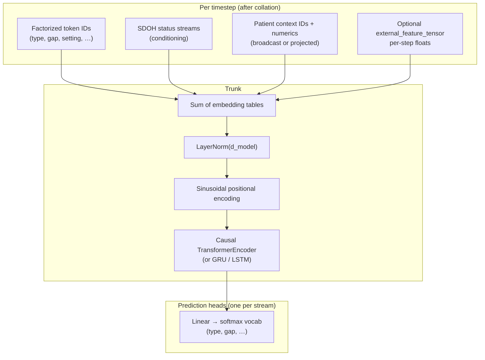

# Patient event sequence model — design and architecture

This document describes the **multi-task autoregressive** model in `modelling/train_patient_event_model.py`, how data flows from the tokenized `.pt` artifact, and how training / evaluation are defined. For vocabulary and upstream tokenization, see [`../README.md`](../README.md) and [`../tokenization.md`](../tokenization.md).

## Purpose

Given a **longitudinal patient event sequence** (encounters and related fields as discrete token streams per timestep), the model learns to predict **the next step’s tokens** for multiple clinical and administrative attributes at once: visit type, setting, department, codes, gaps, etc. Optional **per-timestep numeric context** (e.g. market / area features) and **static patient context** are used as **inputs only** (extra conditioning).

The framing matches **within-patient forecasting**: “given what we have seen so far for this patient, predict the next event attributes.” Generalization to **entirely unseen patients** is a different experiment (e.g. patient-level split); see `--split-strategy patient_holdout`.

---

## High-level diagram

---

## Inputs and tensor shapes

### Sequence artifact (`--input` `.pt`)

Each patient contributes one sequence dict with aligned lists (same length per stream), including:

| Concept | Typical tensor keys | Role |
|--------|---------------------|------|
| Core WHAT/WHEN/WHERE | `type_ids`, `event_description_ids`, `group_code_ids`, `diagnosis_value_ids`, `gap_ids`, `setting_ids`, `dept_type_ids`, `dept_specialty_ids`, `facility_size_ids`, `region_ids` | Discrete tokens per event step; each has an embedding table. |
| SDOH | Per-stream `sdoh_*_latest_status_ids` (names from vocab / data) | **Conditioning only** — embedded and added to the token representation; **no** dedicated prediction head in `HEAD_TO_TARGET`. |
| Patient context | `patient_context_ids`, `patient_context_values` | Static categoricals (embedded per field, summed then broadcast to every timestep) and optional numerics (linear → `d_model`, broadcast). |
| External categoricals | Extra `<base>_ids` aligned with `type_ids` | Discovered automatically; embedding + head + loss (`--w-external`). |
| External numerics | `external_feature_tensor` (default name) | `[seq_len, D]` per patient; linear `D → d_model`, **added per timestep**; no CE head. |

Vocabulary maps (`*_to_id`), special tokens, and metadata come from **`--vocab-json`** (recommended: `final_token_format.json`). Loader logic is in `load_prepared_pt()`.

### Batch layout

- All streams are padded to **`--max-seq-len`**; padded targets use **`-100`** for cross-entropy `ignore_index`.
- **`attention_mask`**: 1 for real steps, 0 for pad (padding masked in the Transformer).

---

## Causal alignment (next-step prediction)

For each discrete stream, the dataset builds:

- **`input_*`**: `[BOS] + sequence[:-1]` — at time `t`, input is the **previous** token (or BOS at `t=0`).
- **`target_*`**: full sequence — at time `t`, the model predicts **`target[t]`** from representations that only attend to positions **≤ t** (causal mask).

So **`outputs[head][b, t, :]`** lines up with **`target_*[b, t]`** (no off-by-one). Assertions live in `_assert_logits_targets_aligned()` / `compute_losses()`.

---

## Model class: `PatientEventSequenceModel`

### Embedding fusion

- One **embedding table per stream** (plus optional external streams).
- Vectors are **summed** (not concatenated), then **`LayerNorm(d_model)`** stabilizes scale before the backbone.
- **PositionalEncoding** (sinusoidal, fixed) and **dropout** follow.

### Backbone (default: Transformer)

- **`nn.TransformerEncoder`** with **`norm_first=True`** (pre-LN), **GELU**, **FFN = 4 × d_model**.
- **Causal self-attention**: bool mask so position `t` cannot attend to future positions; **padding mask** for padded timesteps.
- Alternatives: **`--backbone gru`** or **`lstm`** (sequential; no separate causal mask object).

### Output heads

- For each key in **`merge_head_to_target()`** (core heads + external bases): **`Linear(d_model, vocab_size)`**.
- Forward returns a dict **`head_key → logits`** with shape **`[batch, time, num_classes]`**.

Default hyperparameters (CLI): **`d_model=128`**, **`n_heads=4`**, **`n_layers=2`**, **`dropout=0.1`**, **`max_seq_len=128`**.

---

## Loss and metrics

### Multi-task cross-entropy

- Per head: CE over classes at each active timestep; **`label_smoothing`** and **`ignore_index=-100`** apply as in PyTorch.
- **Weighted sum** `total = Σ weight_k · loss_k` over heads present in `weights` (CLI `--w-type`, `--w-gap`, …, `--w-external`).

### Temporal masking (`split_strategy=temporal`)

- Each timestep has a **`split_role`**: train / val / test (or ignore for padding).
- **Training**: loss only where `split_role == TRAIN`.
- **Validation / test**: metrics only where role is VAL or TEST; **no backward** through those positions.

**Temporal fractions** (defaults, renormalized to sum to 1): **70% train / 15% val / 15% test** along the **event index** within each sequence (after truncation). Boundaries are computed in `temporal_split_ends()`.

### Same number of batches for train / val / test

The **same** `Dataset` (all patients) is iterated for train (shuffle on) and for eval (shuffle off). **Batches are identical in count** because the dataset size is fixed; what changes is **which timesteps contribute to the loss** per phase — not a disjoint patient split.

### Combined val+test eval (efficiency)

`run_eval_temporal_val_test_combined()` performs **one forward per batch**, then computes val and test losses from **different `split_role` masks** (and accuracy separately). This halves forward passes versus two full eval loops.

### Metric semantics (important)

- **Reported CE / per-head means** over an epoch: **average of per-batch means** (each batch’s loss is already mean over active tokens in that batch). **Batches** are weighted equally, not tokens.
- **Accuracy / top-k**: **micro** over all active tokens in the pass (`correct / total`).

So loss curves and accuracy are **not** exactly comparable in aggregation semantics; both are still useful for trends.

---

## Training loop (summary)

| Component | Typical setup |
|-----------|----------------|
| Optimizer | **AdamW** (`--lr`, `--weight-decay`) |
| Scheduler | **Cosine** or **warmup + cosine** (`--lr-scheduler`, `--warmup-epochs`, `--lr-min-ratio`) |
| Regularization | **Label smoothing**, **dropout**, **grad clip** (`--grad-clip`) |
| Logging | **`log.info`** per epoch (totals + **per-head mean CE**); optional **`--log-file`**; **`--log-batch-interval`** for intra-phase running means |
| Artifacts | **`training_metrics.jsonl`**, **`training_history_snapshot.json`** each epoch (unless `--no-incremental-metrics`) |
| Checkpoints | **`checkpoint_last.pt`**, optional **`checkpoint_best.pt`** after **full** epoch (train → val → test for temporal); **`--checkpoint-every 0`** disables |

Final bundle: **`patient_event_model.pt`** (weights + args) and **`patient_event_model_artifacts.json`** (vocabs, history, metadata).

---

## Split strategy: `patient_holdout`

- Random split of **whole patient sequences** into train vs validation (`--valid-fraction`).
- No built-in test split; record field **`test`** is **`null`**.
- Loaders differ in size → **batch counts can differ** from temporal mode.

---

## Related scripts

| Script | Role |
|--------|------|
| `modelling/infer_patient_event_model.py` | Load checkpoint; export per-timestep predictions to CSV (optional label decode). |
| `modelling/diagnose_prediction_collapse.py` | Compare accuracy to majority baseline and prediction diversity on val/test masks. |

---

## Design choices and limitations (short)

- **Summed embeddings** are simple but mix many modalities in one space; **LayerNorm** helps.
- **Small default Transformer** (128-d, 2 layers) may underfit very noisy or high-cardinality heads; monitor **per-head** metrics, not only `total`.
- **Temporal split** evaluates **later** timesteps on the **same** patients as early timesteps; use **holdout** when the claim is about **new patients**.

---

## File reference

| Path | Content |
|------|---------|
| `modelling/train_patient_event_model.py` | Model, dataset, training, checkpoints |
| `modelling/infer_patient_event_model.py` | Inference export |
| `modelling/diagnose_prediction_collapse.py` | Sanity check vs majority baseline |
