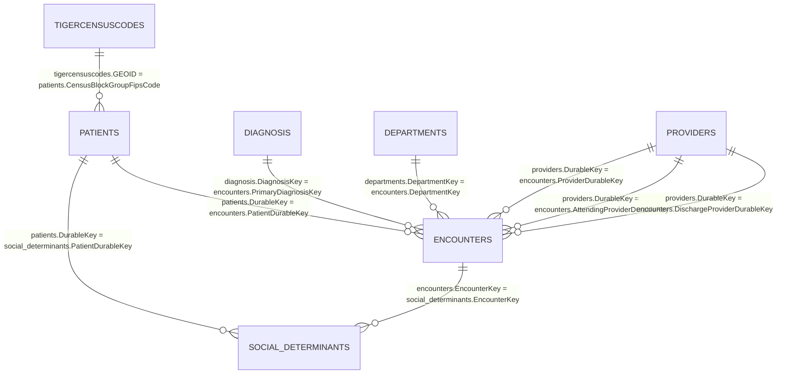

# DataFest 2026 Dataset Relation Model

Generated: 2026-05-02  
Status: **schema-synced to the explicit column lists supplied by the team**

## Purpose

This file documents the relational structure across the seven DataFest CSV files. It is intended to be the team's source of truth for joins, entity definitions, and key-handling rules before building patient journeys, sequence tokens, analytic tables, or model features.

## No-assumption schema rule

All column names below use the exact column names supplied by the team. Do not introduce spaces, alternate spellings, or renamed source columns in raw/staging code.

Examples of exact-name corrections:

- Use `DepartmentName`, **not** `Department Name`.
- Use `CENTLON`, **not** `CENTLONG`.
- Use `PopulationValue`, **not** `Population`.
- `providers.DurableKey` links to provider-role columns in `encounters`; it does **not** link to `patients`.

Derived tables may use snake_case aliases, but every derived alias must map back to one exact source column.

## Dataset inventory

| CSV file | Internal table name | Documented size | Unit / role |
|---|---|---:|---|
| `encounters.csv` | `encounters` | 7,675,801 × 31 | One encounter between one patient and the health system; core event spine. |
| `patients.csv` | `patients` | 947,685 × 12 | One active patient record during the data period; patients may have zero, one, or many encounters. |
| `diagnosis.csv` | `diagnosis` | 1,531,262 × 5 | Diagnosis lookup/vocabulary. |
| `departments.csv` | `departments` | 11,597 × 9 | Department/location metadata for where an encounter occurred. |
| `providers.csv` | `providers` | 299,075 × 8 | Provider metadata for care team members and provider-like encounter roles. |
| `social_determinants.csv` | `social_determinants` | 3,977,901 × 5 | One answered social determinant question during a specific encounter. |
| `tigercensuscodes.csv` | `tigercensuscodes` | 2,463 × 4 | Kansas Census block group lookup with centroid and population fields. |

## Exact source columns by file

### `departments.csv`

```text
DepartmentKey
Address
City
County
DepartmentName
DepartmentSpecialty
DepartmentType
PostalCode
CensusTract
```

### `diagnosis.csv`

```text
DiagnosisKey
GroupName
GroupCode
DiagnosisName
DiagnosisValue
```

### `encounters.csv`

```text
Date
AdmissionInstant
AdmitYear
AdmitMonth
AdmitDay
AdmitHour
AdmitMinute
AdmissionSource
AdmissionType
DischargeInstant
DischargeYear
DischargeMonth
DischargeDay
DischargeHour
DischargeMinute
EncounterKey
PatientDurableKey
Type
VisitType
VisitTypeDescription
ProviderDurableKey
AttendingProviderDurableKey
DischargeProviderDurableKey
DepartmentKey
PrimaryDiagnosisKey
IsEdVisit
IsHospitalAdmission
IsHospitalOutpatientVisit
IsInpatientAdmission
IsObservation
IsOutpatientFaceToFaceVisit
```

### `patients.csv`

```text
CensusBlockGroupFipsCode
DurableKey
FirstRace
MaritalStatus
MyChartStatus
OmbEthnicity
OmbRace
SexAssignedAtBirth
SexualOrientation
SmokingStatus
VitalStatus
PatientBirthYearBin
```

### `providers.csv`

```text
DurableKey
ClinicianTitle
OfficeAddress
OfficeCity
OfficePostalCode
PrimaryDepartment
PrimarySpecialty
Type
```

### `social_determinants.csv`

```text
DisplayName
AnswerText
EncounterKey
PatientDurableKey
Domain
```

### `tigercensuscodes.csv`

```text
GEOID
PopulationValue
CENTLAT
CENTLON
```

## Entity relationship diagram



## Canonical join map

| Left table | Left key | Right table | Right key | Expected cardinality | Notes / caveats |
|---|---|---|---|---|---|
| `patients` | `DurableKey` | `encounters` | `PatientDurableKey` | 1 → many | Core patient-to-encounter relationship. Some patients may have no encounters in the data window. |
| `encounters` | `EncounterKey` | `social_determinants` | `EncounterKey` | 1 → many | One encounter can have zero, one, or many SDOH question-answer rows. Aggregate before joining to encounter-level marts. |
| `patients` | `DurableKey` | `social_determinants` | `PatientDurableKey` | 1 → many | Patient-level SDOH link. Use together with `EncounterKey` validation to avoid mismatched patient/encounter pairs. |
| `diagnosis` | `DiagnosisKey` | `encounters` | `PrimaryDiagnosisKey` | 1 → many | Encounter primary diagnosis lookup. `PrimaryDiagnosisKey = -1` means no diagnosis needed/given per Read Me. |
| `departments` | `DepartmentKey` | `encounters` | `DepartmentKey` | 1 → many | Department/location where patient was seen. |
| `providers` | `DurableKey` | `encounters` | `ProviderDurableKey` | 1 → many | General encounter provider role. Some values may be unspecified/not applicable/unmatched. |
| `providers` | `DurableKey` | `encounters` | `AttendingProviderDurableKey` | 1 → many | Attending provider role. Some encounters may not have a human/provider match. |
| `providers` | `DurableKey` | `encounters` | `DischargeProviderDurableKey` | 1 → many | Discharge provider role. Mostly relevant for hospital-style discharge contexts. |
| `tigercensuscodes` | `GEOID` | `patients` | `CensusBlockGroupFipsCode` | 1 → many | Patient home Census block group lookup. Suppressed/unknown patient geographies will not join. |

## Recommended SQL-style joins

### Patient enrichment

```sql
encounters.PatientDurableKey = patients.DurableKey
```

### Diagnosis enrichment

```sql
encounters.PrimaryDiagnosisKey = diagnosis.DiagnosisKey
```

Special rule: preserve a flag for `encounters.PrimaryDiagnosisKey = -1` and do not treat it as a real diagnosis unless a row with `DiagnosisKey = -1` is explicitly present and intentionally documented in the raw file.

### Department enrichment

```sql
encounters.DepartmentKey = departments.DepartmentKey
```

### Provider enrichment with role-specific aliases

```sql
encounters.ProviderDurableKey = encounter_provider.DurableKey
encounters.AttendingProviderDurableKey = attending_provider.DurableKey
encounters.DischargeProviderDurableKey = discharge_provider.DurableKey
```

Where each alias is a separate copy/view of `providers`:

```text
providers AS encounter_provider
providers AS attending_provider
providers AS discharge_provider
```

### Social determinant validation/enrichment

```sql
encounters.EncounterKey = social_determinants.EncounterKey
patients.DurableKey = social_determinants.PatientDurableKey
```

Recommended consistency check after joining SDOH to encounters:

```text
social_determinants.PatientDurableKey == encounters.PatientDurableKey
```

### Geography enrichment

```sql
patients.CensusBlockGroupFipsCode = tigercensuscodes.GEOID
```

## File-by-file key details

### `encounters.csv`: event spine

Primary identifier:

- `EncounterKey`: unique encounter-row identifier.

Foreign keys:

- `PatientDurableKey` → `patients.DurableKey`
- `PrimaryDiagnosisKey` → `diagnosis.DiagnosisKey`
- `DepartmentKey` → `departments.DepartmentKey`
- `ProviderDurableKey` → `providers.DurableKey`
- `AttendingProviderDurableKey` → `providers.DurableKey`
- `DischargeProviderDurableKey` → `providers.DurableKey`

Timing fields:

- `Date`
- `AdmissionInstant`
- `AdmitYear`
- `AdmitMonth`
- `AdmitDay`
- `AdmitHour`
- `AdmitMinute`
- `DischargeInstant`
- `DischargeYear`
- `DischargeMonth`
- `DischargeDay`
- `DischargeHour`
- `DischargeMinute`

Encounter classification fields:

- `Type`
- `VisitType`
- `VisitTypeDescription`
- `AdmissionSource`
- `AdmissionType`
- `IsEdVisit`
- `IsHospitalAdmission`
- `IsHospitalOutpatientVisit`
- `IsInpatientAdmission`
- `IsObservation`
- `IsOutpatientFaceToFaceVisit`

Important modeling caveats:

- One real-world visit can generate multiple encounter rows.
- A patient journey should be built from sequences of encounters linked by a diagnosis concept, not from a single row.
- Provider-role keys may be missing, unspecified, structurally not applicable, or unmatched.

### `patients.csv`: patient dimension

Primary identifier:

- `DurableKey`: unique patient identifier.

Foreign/lookup key:

- `CensusBlockGroupFipsCode` → `tigercensuscodes.GEOID`

Patient attributes:

- `FirstRace`
- `MaritalStatus`
- `MyChartStatus`
- `OmbEthnicity`
- `OmbRace`
- `SexAssignedAtBirth`
- `SexualOrientation`
- `SmokingStatus`
- `VitalStatus`
- `PatientBirthYearBin`

Important modeling caveats:

- Patients may have zero encounters in the encounter file.
- `CensusBlockGroupFipsCode` may be suppressed or unavailable for privacy or missingness reasons.

### `diagnosis.csv`: diagnosis lookup

Primary identifier:

- `DiagnosisKey`: lookup key joined from `encounters.PrimaryDiagnosisKey`.

Diagnosis attributes:

- `GroupName`
- `GroupCode`
- `DiagnosisName`
- `DiagnosisValue`

Critical journey rule:

- Use `PrimaryDiagnosisKey` / `DiagnosisKey` for the **join**.
- Use `DiagnosisValue` or `DiagnosisName` for **journey identity**, because diagnosis keys may change over time even when the underlying condition is stable.

### `departments.csv`: department/location dimension

Primary identifier:

- `DepartmentKey`: joined from `encounters.DepartmentKey`.

Department/location attributes:

- `Address`
- `City`
- `County`
- `DepartmentName`
- `DepartmentSpecialty`
- `DepartmentType`
- `PostalCode`
- `CensusTract`

Potential derived uses:

- Care-setting labels from `DepartmentType`.
- Specialty labels from `DepartmentSpecialty`.
- Department geography and approximate access features from `City`, `County`, `PostalCode`, and `CensusTract`.

### `providers.csv`: provider dimension

Primary identifier:

- `DurableKey`: provider identifier joined from provider-role columns in `encounters`.

Provider attributes:

- `ClinicianTitle`
- `OfficeAddress`
- `OfficeCity`
- `OfficePostalCode`
- `PrimaryDepartment`
- `PrimarySpecialty`
- `Type`

Role-specific derived aliases should preserve role identity:

| Encounter source key | Provider alias prefix |
|---|---|
| `ProviderDurableKey` | `provider_*` or `encounter_provider_*` |
| `AttendingProviderDurableKey` | `attending_provider_*` |
| `DischargeProviderDurableKey` | `discharge_provider_*` |

### `social_determinants.csv`: encounter-question responses

Composite analytical anchors:

- `EncounterKey` → `encounters.EncounterKey`
- `PatientDurableKey` → `patients.DurableKey`

Response fields:

- `DisplayName`: question asked.
- `AnswerText`: patient answer.
- `Domain`: social determinant domain.

Important modeling caveats:

- Unit of observation is a question-answer row, not an encounter.
- Directly joining SDOH rows to encounters will multiply encounter rows.
- Aggregate SDOH first if the target unit is one row per encounter, patient, or journey.
- Absence of SDOH rows does not imply absence of social need, because rollout and administration were not universal.

### `tigercensuscodes.csv`: Census block group lookup

Primary/lookup key:

- `GEOID`: joined from `patients.CensusBlockGroupFipsCode`.

Attributes:

- `PopulationValue`
- `CENTLAT`
- `CENTLON`

Potential derived uses:

- Approximate home geography via centroid.
- Population-based geography features.
- Distance/access proxies when paired with department location information.

## Join validation checklist

Run these checks after loading the raw CSVs locally.

### 1. Confirm uniqueness of documented identifiers

- `encounters.EncounterKey`
- `patients.DurableKey`
- `diagnosis.DiagnosisKey`
- `departments.DepartmentKey`
- `providers.DurableKey`
- `tigercensuscodes.GEOID`

### 2. Count unmatched foreign keys

- `encounters.PatientDurableKey` values not found in `patients.DurableKey`.
- `encounters.PrimaryDiagnosisKey` values not found in `diagnosis.DiagnosisKey`, with `-1` counted separately.
- `encounters.DepartmentKey` values not found in `departments.DepartmentKey`.
- `encounters.ProviderDurableKey` values not found in `providers.DurableKey`.
- `encounters.AttendingProviderDurableKey` values not found in `providers.DurableKey`.
- `encounters.DischargeProviderDurableKey` values not found in `providers.DurableKey`.
- `patients.CensusBlockGroupFipsCode` values not found in `tigercensuscodes.GEOID`, with suppressed/unknown values counted separately.

### 3. Validate SDOH consistency

- `social_determinants.EncounterKey` found in `encounters.EncounterKey`.
- `social_determinants.PatientDurableKey` found in `patients.DurableKey`.
- After joining `social_determinants` to `encounters` by `EncounterKey`, verify patient keys agree:

```text
social_determinants.PatientDurableKey == encounters.PatientDurableKey
```

### 4. Preserve missingness semantics

- Values beginning with `*` should be retained separately from unstarred missing-like values.
- Do not collapse `*Unspecified`, `Unspecified`, `*Unknown`, `Unknown`, `NA`, blank, and `*Not Applicable` into one category before analysis.

## Safe default join order

```text
1. Load all seven files.
2. Validate exact column names against the schemas in this file.
3. Clean key columns as strings unless raw schema proves numeric-only behavior is safe.
4. Build encounter_enriched from encounters.
5. Left join patients on encounters.PatientDurableKey = patients.DurableKey.
6. Left join diagnosis on encounters.PrimaryDiagnosisKey = diagnosis.DiagnosisKey; flag PrimaryDiagnosisKey = -1.
7. Left join departments on encounters.DepartmentKey = departments.DepartmentKey.
8. Left join three provider aliases for ProviderDurableKey, AttendingProviderDurableKey, and DischargeProviderDurableKey.
9. Aggregate social_determinants to encounter-level features, then left join by EncounterKey.
10. Left join tigercensuscodes to patients by patients.CensusBlockGroupFipsCode = tigercensuscodes.GEOID before or during encounter enrichment.
```

## Do-not-assume list

- Do not assume undocumented column names.
- Do not assume `Department Name` exists; the exact column is `DepartmentName`.
- Do not assume `CENTLONG` exists; the exact column is `CENTLON`.
- Do not assume `Population` exists; the exact column is `PopulationValue`.
- Do not assume `PrimaryDiagnosisKey` is stable for longitudinal journey definition.
- Do not assume one clinic/hospital visit equals one encounter.
- Do not assume every patient has encounters.
- Do not assume every encounter has a diagnosis.
- Do not assume every provider key joins successfully.
- Do not assume `providers.DurableKey` joins to `patients.DurableKey`; it joins to provider-role columns in `encounters`.
- Do not assume lack of SDOH response equals lack of social need.
- Do not assume unknown/suppressed geography is random.
- Do not assume every missing-like value has the same meaning.
